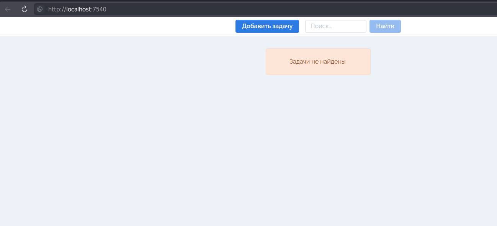
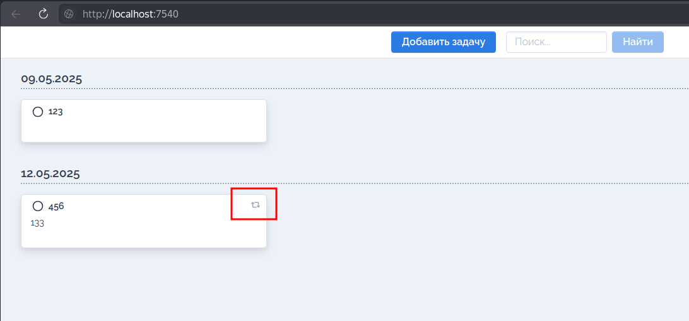
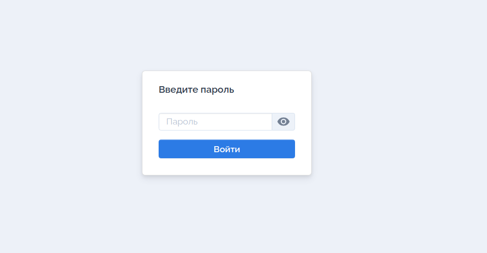
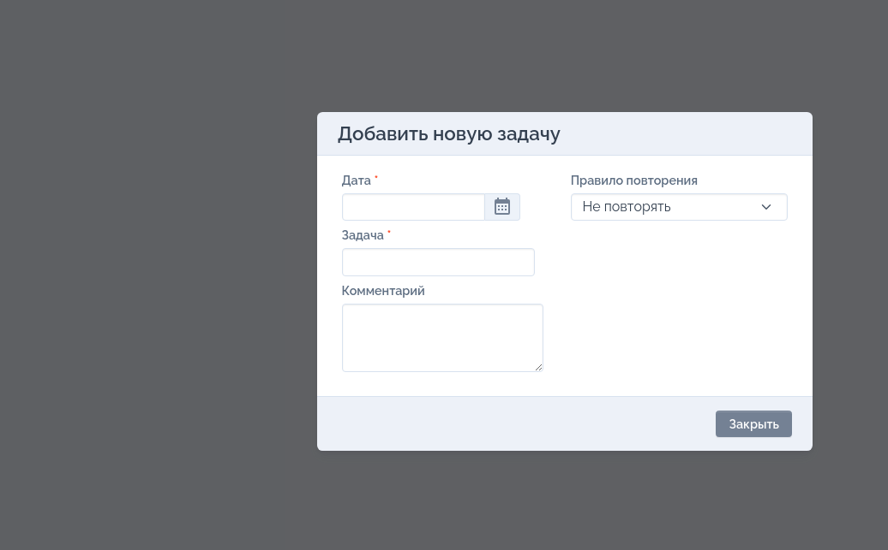
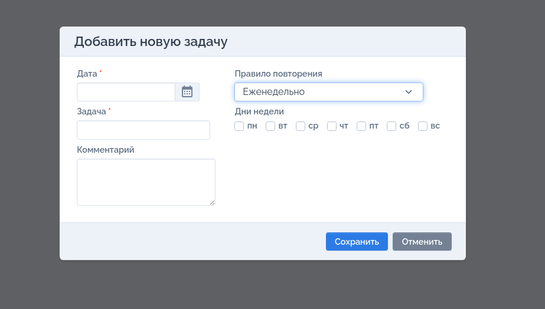
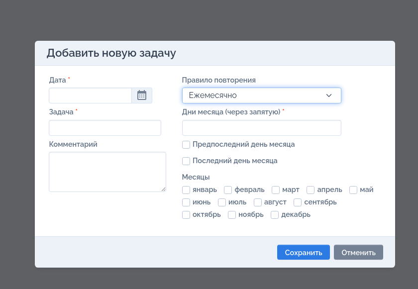
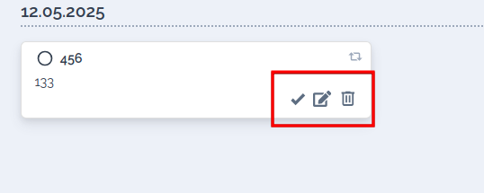

# Итоговый проект курса

## Приложение-планировщик **Tasker**

**Tasker** — компактное веб-приложение для удобного управления задачами и напоминаниями. Ваш цифровой помощник в организации повседневных дел 📌✍️.

### Основные возможности:
- 📌**Создание задач**: поддерживаются как однократные, так и регулярные мероприятия.
- ✏️**Редактирование задач**: внесение изменений в созданные пункты.
- ⚠️**Удаление задач**: очистка списка от завершённых или устаревших элементов.
- ✅**Отметка выполнения**: отмеченная как выполненная одноразовая задача удаляется, а повторяющаяся перемещается на следующий срок.

Типы повторяющихся задач:
- 🗓 Повтор каждые *X* дней
- 📆 Еженедельные повторы по указанным дням
- 🤖 Месячные повторы по заданным числам месяца
- 🎂 Годовые повторы

Реализован простой уровень защиты данных через базовую систему аутентификации Basic Auth.

Пользовательский интерфейс:
- Основной экран показывает список текущих задач 
- Повторяющиеся задачи обозначаются специальным значком  
- Если включена аутентификация, появится окно ввода пароля при входе 
- Добавлять новые задачи можно прямо из интерфейса, нажимая соответствующую кнопку 
- Можно выбрать правила повторения задачи при создании, такие как ежедневные, еженедельные, 
ежемесячные или ежегодные повторы  
- Созданную задачу легко просмотреть, изменить или удалить 


### Дополнительные функции (задания под звездочкой):
- Поддержка переопределения порта через переменную среды (`TODO_PORT`)
- Выбор произвольного имени файла базы данных (`TODO_DBFILE`)
- Поддержка разных видов повторений задач (ежедневные, еженедельные, ежемесячные, ежегодные).
- Фильтрация задач по названию или дате.
- Базовая аутентификация с помощью пароля.
- Возможность запуска в контейнере Docker.

---
## Инструкция по установке и запуску

Есть три способа развернуть проект:

### Способ №1: Сборка вручную через Go
Необходимый минимум:
- Версия Go >= 1.23.0

Шаг 1: Клонируйте репозиторий к себе на компьютер:

```bash
git clone https://github.com/sakojpa/tasker.git
```

Шаг 2: Соберите и запустите приложение командой:

```bash
go run main.go
```

Приложение стартует на порту 7540 по умолчанию, сохраняя данные в файле scheduler.db, расположенном в корневой директории проекта.  
Настройки можно изменять следующим образом:
- Изменив конфиг-файл `config.yaml`
- Или передав нужные значения через переменные окружения при запуске приложения.

Например, изменение порта и файла базы данных:

```bash
TODO_PORT=8080 TODO_DBFILE=custom_db_file.db go run main.go
```

Или экспортировав переменные окружения отдельно перед запуском:

```bash
export TODO_PORT=8080
export TODO_DBFILE=custom_db_file.db
go run main.go
```

> [!WARNING]
> 
> Обратите внимание, что изменение переменных окружения затронет работу всех приложений, запущенных в данном терминале.

Чтобы активировать парольную защиту, установите переменную окружения TODO_PASSWORD или включите параметр 
Enabled в разделе Auth конфигурационного файла.

#### Тесты
Запуск тестов осуществляется командой
```shell
go test -v ./tests -count=1
```
При изменении стандартных настроек (порт, имя файла базы данных) убедитесь, что эти изменения учтены и при тестировании:
```shell
TODO_PORT=8080 TODO_DBFILE=custom_db_file.db go test -v ./tests -count=1
```

Для проведения дополнительных тестов, которые включают в себя режим FullNextDate и Search необходимо передать следующие переменные окружения:
- `TODO_FULLNEXTDATE=true` - включает режим FullNextDate для проверки задач с недельными и месячными интервалами
- `TODO_SEARCH=true` - включает режим Search для проверки корректности поиска задач

Для запуска тестов в режиме аутентификации необходимо получить аутентификационный токен и указать его в переменной `TODO_TOKEN`  
Токен можно взять из значения куки в режиме разработчика, либо через следующую команду c указанием пароля, после запуска проекта:
```shell
export TOKEN=$(curl -s 'http://localhost:7540/api/signin' -H 'Content-Type: application/json' -d '{"password":"123"}' | jq -r '.token')
```
```shell
TODO_PORT=8080 TODO_DBFILE=custom_db_file.db TODO_TOKEN=${TOKEN} go test -v ./tests -count=1
```
Полный пример запуска тестов со всеми параметрами:
```shell
TODO_FULLNEXTDATE=true TODO_SEARCH=true TODO_PORT=8080 TODO_DBFILE=custom_db_file.db TODO_TOKEN=${TOKEN} go test -v ./tests -count=1
```

---

### Способ №2: Автоматическая сборка через Makefile
Минимальные требования:
- Go >= 1.23.0
- утилита `make`
- пакеты `jq` и `curl`

Запустите сборку и тестирование через Makefile:

```bash
git clone https://github.com/sakojpa/tasker.git
cd tasker
make run
```
Дополнительно предусмотрена возможность автоматического включения защиты паролем:
```bash
make run-with-auth
```

Стандартные настройки:
- Порт сервера: 7540
- Имя файла базы данных: scheduler.db 

Доступные переменные для переопределения стандартного поведения:
- `RUN_PORT`      - переопределение порта запуска (7540 default)
- `RUN_DBFILE`    - переопределение файла базы данных (scheduler.db default)

Доступно в run-with-auth:
- `RUN_PORT`      - переопределение порта запуска (7540 default)
- `RUN_DBFILE`    - переопределение файла базы данных (scheduler.db default)
- `RUN_PASSWORD`  - переопределение стандартного пароля (123 default)


Примеры запуска с переопределением стандартных параметров:
```shell
RUN_PORT=8080 RUN_DBFILE=custom_db_file.db make run
```
или с защитой паролем:
```shell
RUN_PORT=8080 RUN_DBFILE=custom_db_file.db RUN_PASSWORD=qazwsx123 make run
```
#### Запуск тестов
Запуск тестов осуществляется тем же способом, что и в пункте выше.  
Так же для данного типа запуска определен способ сразу запустить приложение и прогнать тесты:
```shell
make run-n-test
```
```shell
make run-n-test-with-auth
```
Обе команды запустят тесты приложение с настройками по умолчанию, произведут запуск тестов и выключат приложение.

---

### Способ №3: Работа через контейнер Docker
Требования:
- Docker установлен и настроен

Docker позволяет быстро развернуть готовое окружение, включая базу данных SQLite и веб-сервер.

Скопируйте код проекта, соберите образ и запустите контейнер стандартными командами Docker.  
Так же доступны инструкции по сборке образа в `Makefile`:
Сборка образа
```shell
make build-docker
```
Сборка и запуск со стандартными настройками: 
```shell
make run-docker
```
Переопределение параметров запуска приложения происходит передачей параметров мейк файлу: 
```shell
DOCKER_RUN_OPTS="-e TODO_PORT=8080 -p 8080:8080" make run-docker
```
Этот пример приведёт к запуску приложения на порту 8080 и выполнению прокси-мэппинга порта контейнера на локальном хосте.

### Тестирование
Процесс тестирования идентичен описанному в первом варианте установки.

---
